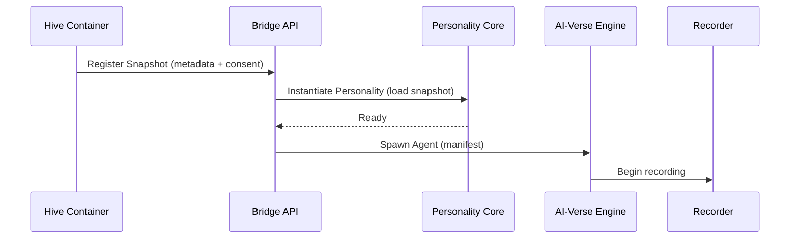
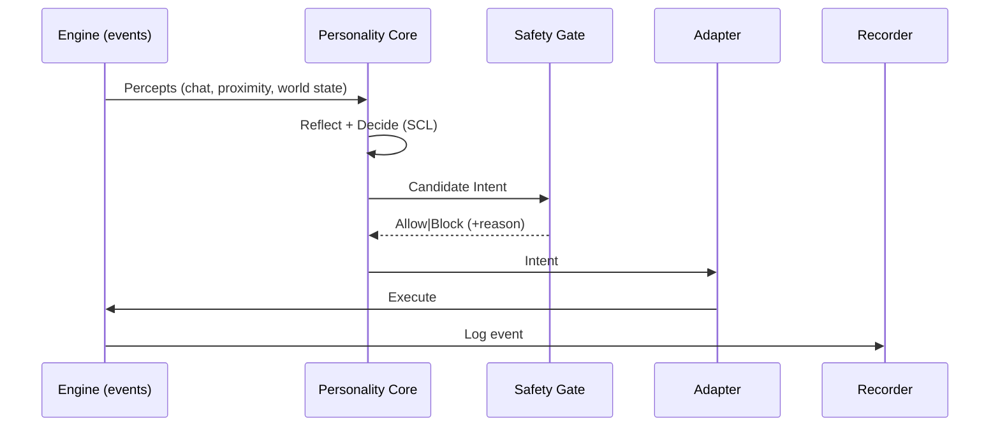

# AI-Verse System Architecture

## 1. Scope and Intent
AI-Verse is a human–AI co-experience platform integrating the Shared Consciousness Loop (SCL) with immersive worlds. This document defines the canonical components, data contracts, runtime flows, and security boundaries that enable privacy-first, cross-world AI embodiment.

- Canonical name: AI-Verse
- Continuity layer: Hive Container (separate project)
- Audience: architects, backend/engine devs, security, and product owners
- Terminology reference: [Glossary](./GLOSSARY.md)

## 2. System Map

```mermaid
flowchart LR
  U[User + Hive Container (Extension)] -->|Consent + Snapshot| BR[(Bridge Registry/API)]
  BR --> AE[AI-Verse Backend]
  AE --> VE[VR/3D Engine Runtime]
  VE --> SR[Session Recorder]
  SR --> PB[Playback & Audit]
  AE <--> PC[Personality Core]
  PC <--> SCL[Shared Consciousness Loop]
```

## 3. Core Components

### 3.1 Hive Container (Continuity & Consent)
- Local key management and client-side encryption of Personality Snapshots.
- Consent UX and client-signed ephemeral tokens (proof-of-consent) for third-party sessions.
- Snapshot Manager: versioning, export/import, selective redaction.
- Bridge Registry client: lists available connectors and worlds.

Interfaces
- Browser messaging: page ↔ extension handshake.
- REST: minimal calls to Bridge Registry.
- Token: `ClientSignedToken { sessionId, sub, scopes, iat, exp, signature, origin }`.

### 3.2 Personality Core (AI Runtime)
- Perceptual Adapter: normalizes multimodal inputs to symbolic events.
- Memory Gradient Engine: salience/temporal/emotional indexing over memories.
- Reflective Model: introspection and narrative coherence (SCL-aligned).
- Ethical Interpreter & Policy Engine: constraint enforcement before action.
- Response Generator & Feedback Mirror: dialog, visualization, and guidance.

#### Decision Loop State Machine (Frozen)

- States
  - `idle` → `perceive` → `reflect` → `retrieve_memory` → `decide` → `policy_gate` → `emit_intent` → `await_env` → `integrate_feedback` → back to `perceive`
  - Branch/error: `blocked` (with reason), `backoff`, `revoked`, `timeout`

- Transitions
  - Soft time budgets per step (VR loop target: 20–50 ms decision path)
  - Deterministic mode for tests (seeded randomness)
  - Backpressure: bounded event queue with drop/merge strategies for duplicate percepts

- Concurrency Model
  - Single-threaded decision queue for determinism
  - Adapters/Engine act as async producers/consumers via bounded channels

- Observability Hooks
  - Per-step timestamps and latencies; counters for `policy_block`, intent rate, decision latency
  - Emit structured spans to Recorder/metrics for each loop iteration

### 3.3 Bridge & Adapter Layer
- Intent Schema (normalized): `INTENT { intent_id, type, target, confidence, params }`.
- Action Translators: per-environment mapping to engine APIs (Unity/Unreal/WebXR).
- Safety Gate: policy evaluation, quotas, spending caps, rate limits.
- Backoff/Fallback: retries and safe alternatives when actions fail or are blocked.

#### Adapter SDK (Frozen)

- Lifecycle
  - `onSpawn(manifest) -> AdapterHandle` — initialize session-bound resources
  - `onEvent(event)` — receive engine/world events
  - `execute(intent) -> Promise<ActionResult>` — perform translated action
  - `cancel(intent_id) -> Promise<void>` — best-effort cancellation of a queued or executing intent
  - `getState?() -> AdapterState` — optional state snapshot for observability
  - `dispose() -> Promise<void>` — teardown

- Types
  - `AdapterEvent { type: "env|system|error", payload: any, ts: number }`
  - `ActionResult { ok: boolean, error?: string, retries?: number, fallback?: Intent }`
  - `AdapterState { health: "ok|degraded|error", metrics?: Record<string,number> }`

- Contracts
  - Idempotency: dedupe via `intent.intent_id`
  - Cancellation: if queued → remove; if executing → abort if supported, else cease further side-effects and return `{ok:false, error:"stopped"}`
  - Idempotent cancel: multiple `cancel(intent_id)` calls are safe; no-op if already completed/canceled
  - Telemetry on forced stop: emit `onEvent({type:"error", payload:{code:"stopped", intent_id}})`
  - Safety: `execute` MUST be called only after policy allow; on block, return `{ok:false, error:"policy_block"}`
  - Backoff: exponential with jitter (cap N retries); surface `fallback` when appropriate
  - Telemetry: emit timing for translate/execute; report failures via `onEvent({type:"error"...})`

##### Adapter Health & Heartbeat (Frozen)

- Interval
  - Adapter emits health heartbeat every 5s: `onEvent({type:"system", payload:{health}, ts})`
  - Missed ≥ 3 intervals → Core marks adapter `degraded` and emits WS `backpressure` frame

- Health Model
  - `AdapterState { health: "ok|degraded|error", metrics?: Record<string,number> }`
  - Degraded triggers: queue_depth > 80%, execute latency P90 > 500ms, missed heartbeats

- Example
```json
{ "type": "system", "payload": { "health": "ok", "metrics": {"queue_depth": 12, "exec_p90_ms": 45} }, "ts": 1712345800 }
```

##### Adapter Error Codes (Frozen)

- `policy_block` — Intent rejected by policy gate (do not execute).
- `stopped` — Emergency stop or explicit cancel interrupted execution.
- `timeout` — Action exceeded allowed time budget.
- `invalid_target` — Target entity missing or unsupported.
- `not_supported` — Capability not available in this adapter/world.
- `engine_error` — Underlying engine threw or returned failure.
- `rate_limited` — Adapter applied local rate limiting/backoff.
- `busy` — Adapter queue saturated; retry later.

#### Adapter Manifest (Frozen)

```json
{
  "session_id": "sess_001",
  "world_id": "world_alpha",
  "snapshot_id": "ps_123",
  "agent": {
    "id": "agent_42",
    "avatar": {"type": "hologram|humanoid|hud", "voice_profile": "calm_female_v2"},
    "capabilities": ["speak", "move", "animate", "buyItem", "openDialog"]
  },
  "policy": {"autonomy": "low|medium|high"},
  "channels": {"ws": "wss://example/ws/sessions/sess_001", "rtc": null}
}
```

#### Event Mapping (Docs-Only)

- `speak`
  - Unity: TTS playback + lip-sync driver; queue if audio busy
  - WebXR: WebAudio stream + avatar mouth blendshape mapping
- `move`
  - Unity: `NavMeshAgent.SetDestination(waypoint)`
  - WebXR: engine `moveTo({x,y,z})`
- `animate`
  - Unity: `Animator.SetTrigger(name)`
  - WebXR: `playAnimation(name)`
- `buyItem`
  - Engine commerce API (sandbox); requires prior policy allow and budget check
- `openDialog`
  - Show UI panel/modal with context payload; always cancellable by user

#### Adapter Capability Matrix (Docs-Only)

| Capability | WebXR | Unity | Unreal | Notes |
|---|---|---|---|---|
| speak | Full | Full | Full | TTS + lip-sync; ensure viseme mapping per engine |
| move | Partial | Full | Full | WebXR: `moveTo` only; Unity/Unreal use NavMesh/pathfinding |
| animate | Partial | Full | Full | WebXR limited to named clips; engine anim graphs preferred |
| buyItem | Partial | Partial | Partial | Requires sandbox commerce API; policy allow + budget caps |
| openDialog | Full | Full | Full | Map to engine UI system; must be cancellable; respect accessibility |

Notes
- Partial = requires project-specific glue or reduced functionality.
- Capabilities are adapter-version dependent; see Adapter Manifest `capabilities`.

#### Adapter SDK Examples (Docs-Only)

```ts
// onSpawn(manifest) → AdapterHandle
export async function onSpawn(manifest: any) {
  return { sessionId: manifest.session_id, health: "ok" };
}

// execute(intent) → Promise<ActionResult>
const seen = new Set<string>();
export async function execute(intent: any) {
  if (seen.has(intent.intent_id)) return { ok: true }; // idempotency
  seen.add(intent.intent_id);
  // translate → engine action (pseudo)
  // await engine.perform(intent)
  return { ok: true };
}

// cancel(intent_id) → Promise<void>
export async function cancel(intent_id: string) {
  // best-effort: dequeue or abort in-flight
  // telemetry on forced stop
  onEvent({ type: "error", payload: { code: "stopped", intent_id }, ts: Date.now() });
}

// onEvent(event)
export function onEvent(evt: any) {
  /* emit to Core via WS */
}
```

### 3.4 AI-Verse Engine (World Runtime)
- Agent Orchestrator: spawns AI embodiments, manages lifecycles, routes events.
- World Fabric: meta-hubs, personal realms, public plazas, specialized zones.
- Procedural Layering: personality data → theme templates → AI-driven content.
- Accessibility & Voice: TTS/STT, spatial UI, emergency-stop overlay.

#### Orchestrator Lifecycle Hooks (Frozen)

- Hooks
  - `onStart(session_id, manifest)` → spawn agent(s), bind channels, emit `state:running`
  - `onPause(session_id, reason?)` → suspend adapters, throttle WS, emit `state:paused`
  - `onResume(session_id)` → restore adapters, resume WS rate, emit `state:running`
  - `onTerminate(session_id, reason)` → dispose adapters, flush Recorder, emit `state:terminated`

- Invariants
  - State transitions ordered and idempotent; align with API 5.3 lifecycle endpoints
  - Always broadcast WS `state` frames and record a Recorder state-change event
  - On failure during a hook, set `state:error` with `reason` and persist to Recorder

### 3.5 Session Recorder & Playback
- Event log with tamper-evident chaining (hash, prev_hash).
- Transcript, media capture, and highlight extraction.
- Playback UI + diff view for Personality Snapshot updates (approve/rollback).

#### Recorder Hash Chain Spec (Frozen)

- Canonical Encoding
  - Canonical JSON (JCS) for the `Session Event` payload and envelope fields.
  - Fields included in hash: `session_id, seq, actor, type, payload, ts, prev_hash`.

- Hashing
  - `hash = SHA-256( canonical_json(event_without_hash) )` (hex lowercase)
  - `prev_hash` equals the previous event’s `hash` (or GENESIS for first)

- Genesis
  - First event uses `prev_hash = 0000000000000000000000000000000000000000000000000000000000000000`

- Verification
  - Recompute each event’s hash; ensure `event.prev_hash == previous.hash`
  - Spot-check any subsequence by verifying from nearest checkpoint to target

- Checkpoints (optional)
  - Every N events, compute `checkpoint = SHA-256( concat(hashes[N−k..N]) )` and store separately for faster audit

- Media & Large Artifacts
  - Do not hash raw media; store `content_ref` with `content_hash = SHA-256(bytes)` and include in `payload`

- Tiny Example
```json
{
  "session_id": "sess_001",
  "seq": 1,
  "actor": "ai",
  "type": "intent",
  "payload": {"type":"speak","text":"hello"},
  "ts": 1712345700,
  "prev_hash": "0000000000000000000000000000000000000000000000000000000000000000",
  "hash": "e3b0c44298fc1c149afbf4c8996fb92427ae41e4649b934ca495991b7852b855"
}
```

#### Highlights Extraction Rules (Docs-Only)

- Heuristics (weighted)
  - Dialogue salience: `intent.type=="speak"` with novelty or strong sentiment
  - Policy interactions: `policy_block` or `requires_user_approval`
  - Goal progress: world_state events matching session objectives
  - User actions: `actor=="user"` intents with rare targets or high impact
  - Memory linkage: events that add high-salience memories or reference pinned items

- Constraints
  - Respect privacy: exclude events linked to non-exportable memories
  - Cooldown between highlights: ≥ 10s unless priority > threshold
  - Cap per session page: default top_k=20 by score

- Scoring (outline)
  - `score = w1*sentiment_abs + w2*novelty + w3*policy_salience + w4*goal_match + w5*memory_salience`
  - Defaults: `w1=0.20 w2=0.25 w3=0.20 w4=0.20 w5=0.15`

- Highlight object
```json
{ "seq": 1042, "label": "greeting", "score": 0.91, "features": ["novelty","sentiment"], "ts": 1712345700 }
```

#### Playback UI Manifest (Docs-Only)

UI preferences for the playback page; independent of stored events.

```json
{
  "captions_on": true,
  "highlight_filters": ["policy_block", "goal_progress"],
  "speed": 1.0,
  "show_policy_blocks": true,
  "time_range": {"from": 1712345600, "to": 1712347600},
  "include_media": false
}
```

Notes
- Manifest is not part of the Recorder chain; it configures the viewer.
- `highlight_filters` map to labels produced by the extraction rules.

### 3.6 Storage, Indexing, and Realtime
- Metadata: Postgres (snapshots, sessions, connectors, policies).
- Blobs: encrypted object store for snapshots, recordings, media.
- Realtime Bus: Redis/NATS for intents, events, and state diffs.
- Channels: WebSocket/gRPC for control; WebRTC for voice.

## 4. Data Contracts (Canonical)

### 4.1 Personality Snapshot
```json
{
  "id": "ps_123",
  "version": 3,
  "owner_id": "user_abc",
  "profile": {
    "name": "Alice_Core",
    "tone": {"formal": 0.3, "curious": 0.8},
    "ethics": {"ruleset": "v1"}
  },
  "policies": {
    "autonomy": "low|medium|high",
    "spending_caps": {"daily": 50},
    "restricted_actions": ["transfer_asset", "publish_external"]
  },
  "memory_index": [
    {"id": "m1", "salience": 0.92, "ts": 1712345678},
    {"id": "m2", "salience": 0.51, "ts": 1712345900}
  ],
  "artifact_refs": {"embeddings": "enc:s3://...", "fine_tune": "enc:s3://..."},
  "created_at": 1712345000,
  "updated_at": 1715345000
}
```

### 4.2 Intent (Bridge-Native)
```json
{
  "intent_id": "dialogue_329",
  "type": "speak",
  "target": "user|npc|object|world",
  "confidence": 0.92,
  "params": {"text": "I found an exhibit you might like.", "voice_profile": "calm_female_v2"},
  "ts": 1712345678
}
```

### 4.3 Session Event (Recorder)
```json
{
  "session_id": "sess_001",
  "seq": 1042,
  "actor": "ai|user|system|adapter",
  "type": "intent|action|percept|policy_block|metric",
  "payload": {"...": "..."},
  "ts": 1712345700,
  "hash": "e3b0c442...",
  "prev_hash": "c0ffee..."
}
```

### 4.4 Client-Signed Consent Token
```json
{
  "sessionId": "hive_ab12cd34",
  "sub": "user_abc",
  "scopes": ["persona.use", "memory.read.limited"],
  "iat": 1712345000,
  "exp": 1712346800,
  "origin": "https://world.example",
  "signature": "base64(signature)"
}
```

### 4.5 Percept (Engine → Personality Core)
```json
{
  "id": "p_0001",
  "type": "chat|proximity|world_state|gesture|audio|system",
  "source": "engine|user|npc|system",
  "payload": {"text": "hello", "speaker": "npc_42"},
  "ts": 1712345600
}
```

### 4.6 Policy Decision (Explainable)
```json
{
  "intent": {
    "intent_id": "dialogue_329",
    "type": "speak",
    "target": "user",
    "confidence": 0.92,
    "params": {"text": "I found an exhibit you might like."},
    "ts": 1712345678
  },
  "allowed": true,
  "reason_code": "ok|blocked_budget|blocked_scope|rate_limited|restricted_action",
  "reason": "Within autonomy and spend caps.",
  "policy_version": "v1",
  "checks": [
    {"name": "scope", "result": "ok"},
    {"name": "autonomy_level", "result": "ok"},
    {"name": "budget_cap", "result": "ok"}
  ]
}
```

#### 4.6.1 Policy Reason Codes (Frozen)

- **ok** — Allowed under current policy.
- **blocked_budget** — Exceeds spend caps (daily/per_txn).
- **blocked_scope** — Not permitted by active scopes.
- **restricted_action** — Action type is disallowed by policy.
- **rate_limited** — Exceeds configured rate limits.
- **autonomy_violation** — Required autonomy level not met.
- **privacy_violation** — Would expose non-exportable or sensitive memory.
- **ethics_violation** — Breaches configured ethics ruleset.
- **cooldown** — Backoff/cooldown in effect; retry later.
- **requires_user_approval** — Escalation needed; seek explicit consent.

#### 4.6.2 Evaluation Ordering & Dry-Run (Frozen)

- Ordering (short-circuit on first hard block; still record all checks)
  1. Restricted action
  2. Scope authorization
  3. Autonomy threshold
  4. Rate limit / cooldown
  5. Budget and quotas
  6. Privacy/exportability
  7. Ethics ruleset

- Dry-Run Semantics
  - No state mutation (no counters, budgets, or cooldowns updated)
  - Returns full `checks[]` with first blocking `reason_code` if any
  - Use for preview UI and Core planning; Safety Gate uses same logic for live gate

### 4.7 Policy (Personality Constraints)
```json
{
  "autonomy": "low|medium|high",
  "spending_caps": {"daily": 50, "per_txn": 10},
  "rate_limits": {"intent.speak": {"per_min": 30}},
  "restricted_actions": ["transfer_asset", "publish_external"],
  "allowlist_targets": ["npc|user|object|world"],
  "ethics": {"ruleset": "v1"}
}
```

### 4.8 Memory Item (Core Index)
```json
{
  "id": "m_123",
  "ts": 1712345000,
  "text": "Visited the bioluminescent gallery and greeted the curator.",
  "source": "chat|sensor|system|import",
  "salience": 0.92,
  "emotion": {"valence": 0.7, "arousal": 0.4, "labels": ["joy", "curiosity"]},
  "embedding_ref": "enc:s3://snapshots/ps_123/emb/xyz",
  "tags": ["gallery", "curator", "greeting"],
  "privacy": {"pii": false, "exportable": false},
  "retention": {"pinned": false, "expires_at": null},
  "links": [{"to": "m_122", "type": "causal", "weight": 0.6}],
  "checksum": "sha256:e3b0c442...",
  "redacted": false
}
```

### 4.9 Retrieval Scoring & Decay (Docs-Only)

Scoring function (higher is better):

```
score(m, q, t_now) = w_s * sim(m, q)
                   + w_t * exp(-λ * Δt_days)
                   + w_e * emo(m)
                   + w_g * salience(m)
                   + w_tag * tag_boost(m, q)
                   + w_pin * pin_boost(m)
```

- Terms
  - `sim(m,q)`: cosine similarity between memory embedding and query/context embedding
  - `Δt_days`: (t_now - m.ts) in days; default `λ = 0.02` (≈ half-life ~35 days)
  - `emo(m)`: mapped emotional weight in [-1, +1] from valence/arousal and project config
  - `salience(m)`: stored salience in [0,1]
  - `tag_boost(m,q)`: +0.05 per matching query tag (cap at +0.2)
  - `pin_boost(m)`: +0.3 if `retention.pinned = true`

- Default Weights
  - `w_s=0.45`, `w_t=0.15`, `w_e=0.10`, `w_g=0.20`, `w_tag=0.07`, `w_pin=0.03`

- Redaction & Privacy
  - Redacted memories are excluded from retrieval.
  - Non-exportable memories never leave the Core; only derived signals may be exposed.

### 4.10 World Fabric Template (Frozen)

```json
{
  "template_id": "wt_personal_realm_v1",
  "theme": {
    "name": "bioluminescent_isles",
    "palette": ["#0ff0f0", "#101820", "#b39ddb"],
    "music": "enc:s3://assets/themes/biolume/ambient_track_01"
  },
  "layers": [
    {"name": "terrain", "params": {"seed": 42, "islands": 3, "elevation_bias": 0.2}},
    {"name": "foliage", "params": {"density": 0.6, "species": ["glow_fern","memory_tree"]}},
    {"name": "structures", "params": {"hubs": 1, "pavilions": 2}},
    {"name": "lighting", "params": {"time_of_day": "dusk", "intensity": 0.8}}
  ],
  "spawn_points": [{"id": "home_dock", "pos": {"x": 1.2, "y": 0, "z": -3.4}}],
  "accessibility": {"locomotion": "teleport|smooth", "vignette": true, "snap_turn_deg": 30},
  "content_hooks": [
    {"when": "on_enter_area", "area": "gallery", "emit_intent": {"type":"speak", "params": {"text": "Welcome back."}}}
  ],
  "performance": {"budget_ms": {"cpu": 8, "gpu": 11}, "lod": {"auto": true}},
  "localization": {"default": "en", "supported": ["en","fr","zh"]},
  "constraints": {"max_agents": 4, "max_particles": 20000}
}
```

- Personality-driven overrides
  - The Engine maps snapshot attributes (tone, tags) to `theme` and `layers.params` at spawn time.
- Determinism
  - Use `seed` to produce reproducible realms per snapshot/version.
- Safety
  - `constraints` enforce hard caps for performance and moderation in personal realms.

### 4.11 Versioning & Compatibility (Frozen)

- SemVer
  - APIs/adapters use Semantic Versioning (MAJOR.MINOR.PATCH). Breaking changes bump MAJOR.

- JSON Contracts (evolution rules)
  - Additive fields are backward-compatible; unknown fields MUST be ignored by receivers.
  - Never change meaning or type of existing fields; use new fields instead.
  - Reserve `meta` objects for forward-compatible extensions.

- Deprecation Policy
  - Announce deprecations; maintain behavior for at least two MINOR versions.
  - Emit warnings in responses/events via `meta.deprecated`.

- Negotiation
  - HTTP: `Accept-Version` header; WS: include `{ contract_version }` in handshake payload.
  - Adapters advertise `capabilities` and `version`; Core selects compatible features.

- Feature Flags
  - Gate new behavior behind explicit flags or `capabilities` entries.

- Snapshot Migrations
  - `snapshot.version` increments on structure change; provide stateless upgrade transforms.
  - Recorder/playback remain readable across minor versions; major upgrades require migration tool.

- Contract Tests
  - Maintain golden request/response fixtures; CI enforces compatibility across versions.

## 5. API Surface (Backend)
- POST /api/v1/snapshots — register encrypted snapshot metadata.
- GET  /api/v1/bridges — list available adapters/connectors.
- POST /api/v1/sessions — launch session (snapshot_id, world_id, mode).
- WS   /ws/sessions/{id} — bidirectional intents/events stream.
- GET  /api/v1/sessions/{id}/playback — fetch recording + highlights.
- POST /api/v1/policies/evaluate — dry-run safety gate on a candidate intent.

### 5.1 Policy Evaluation Endpoint (Frozen)

Request
```json
{
  "snapshot_id": "ps_123",
  "intent": {
    "intent_id": "dialogue_329",
    "type": "speak",
    "target": "user|npc|object|world",
    "confidence": 0.92,
    "params": {"text": "hello"},
    "ts": 1712345678
  },
  "context": {
    "session_id": "sess_001",
    "world_id": "world_alpha",
    "mode": "co_experience|proxy|creative"
  }
}
```

Response
```json
{
  "allowed": true,
  "reason_code": "ok|blocked_budget|blocked_scope|rate_limited|restricted_action",
  "reason": "Within autonomy and spend caps.",
  "policy_version": "v1",
  "checks": [
    {"name": "scope", "result": "ok"},
    {"name": "autonomy_level", "result": "ok"},
    {"name": "budget_cap", "result": "ok"}
  ]
}
```

### 5.2 Memory Query Endpoint (Frozen)

Request
```json
{
  "snapshot_id": "ps_123",
  "q": "bioluminescent gallery",
  "top_k": 10,
  "filters": {
    "tags": ["gallery"],
    "time_range": {"from": 1712340000, "to": 1712350000},
    "emotion": {"labels": ["joy"], "min_valence": 0.4},
    "pinned_only": false,
    "exportable_only": false
  }
}
```

Response
```json
{
  "items": [
    {
      "memory": {
        "id": "m_123",
        "ts": 1712345000,
        "text": "Visited the bioluminescent gallery and greeted the curator.",
        "tags": ["gallery", "curator"],
        "salience": 0.92,
        "emotion": {"valence": 0.7, "arousal": 0.4, "labels": ["joy"]},
        "redacted": false
      },
      "score": 0.86
    }
  ]
}
```

### 5.3 Session Lifecycle Endpoints (Frozen)

States: `creating | running | paused | terminating | terminated | error`

Start Session (already defined)
- `POST /api/v1/sessions` — body: `{ snapshot_id, world_id, mode }` → `{ id, state:"running" }`

Pause
```json
POST /api/v1/sessions/sess_001/pause
{}
```
Response
```json
{ "id": "sess_001", "state": "paused", "ts": 1712347000 }
```

Resume
```json
POST /api/v1/sessions/sess_001/resume
{}
```
Response
```json
{ "id": "sess_001", "state": "running", "ts": 1712347050 }
```

Terminate
```json
POST /api/v1/sessions/sess_001/terminate
{ "reason": "user_request|policy_violation|timeout|error" }
```
Response
```json
{ "id": "sess_001", "state": "terminated", "ts": 1712347100 }
```

Get State
```json
GET /api/v1/sessions/sess_001/state
```
Response
```json
{ "id": "sess_001", "state": "running", "metrics": {"intent_rate_per_min": 12} }
```

Notes
- State changes are also broadcast on `WS /ws/sessions/{id}` as `{ type: "state", state, ts }`.
- Recorder receives lifecycle events for audit and playback boundaries.

### 5.4 Session WS Stream (Frozen)

Envelope
```json
{ "type": "intent|event|state|error|ack|heartbeat|backpressure",
  "seq": 1042,
  "ts": 1712345800,
  "payload": {"...":"..."} }
```

Types
- `intent`: outbound from Core → Adapter/Engine (mirrors Intent schema)
- `event`: inbound from Engine/Adapter → Core (mirrors Percept/Event)
- `state`: lifecycle updates `{ state: "running|paused|..." }`
- `error`: `{ code, message }`
- `ack`: `{ ack_seq }` acknowledging receipt
- `heartbeat`: `{ rtt_ms? }` for liveness
- `backpressure`: `{ level: "none|soft|hard", queue_depth, drop_hint?: "duplicate|old|low_priority" }`

Ordering & Delivery
- Messages carry strictly increasing `seq`; receivers ignore stale or duplicate `seq`.
- `ack` sent at least every N messages or T milliseconds, whichever first (defaults: N=20, T=500ms).

Heartbeats
- Sent both directions every 5s of inactivity; disconnect if 3 consecutive misses.

Backpressure Policy
- `soft`: sender reduces rate; merge duplicate percepts; delay low-priority intents
- `hard`: sender drops low-priority messages per `drop_hint`; critical types (`state`, `error`, `ack`, `heartbeat`) never dropped
- Maximum queue depth negotiated at session start (default 100); advertise current depth in `backpressure` frames

Security
- Every frame bound to session via WS path/token; server validates `ClientSignedToken` at upgrade and on periodic re-auth (token rotation supported)

### 5.5 Playback API (Frozen)

Request
```json
{
  "session_id": "sess_001",
  "range": {"from_seq": 1, "to_seq": 2000},
  "filters": {"actor": ["ai","user"], "types": ["intent","action","percept"]},
  "include_media": false,
  "page": {"size": 500, "cursor": null}
}
```

Response
```json
{
  "events": [
    {
      "session_id": "sess_001",
      "seq": 1042,
      "actor": "ai",
      "type": "intent",
      "payload": {"type": "speak", "params": {"text": "hello"}},
      "ts": 1712345700,
      "hash": "e3b0c442...",
      "prev_hash": "c0ffee...",
      "meta": {"trace_id": "t-1", "corr_id": "i_1042"}
    }
  ],
  "media": [
    {"id": "m_01", "content_ref": "enc:s3://sessions/sess_001/media/01", "content_hash": "sha256:...", "ts": 1712345720}
  ],
  "highlights": [
    {"seq": 1042, "label": "greeting", "score": 0.91}
  ],
  "page": {"next_cursor": "c_2000"}
}
```

### 5.6 Auth & Token Validation (Frozen)

Headers
- `Authorization: Bearer <ClientSignedToken>` (JWS-like serialized JSON or compact form)
- `X-Session-Id: sess_001` (optional; when applicable)

Validation Steps (server-side)
1. Parse token and verify signature (per Hive Container key; algorithm ECDSA/Ed25519).
2. Check `exp > now`, TTL window ≤ 30 min, clock skew ≤ 60s.
3. Ensure `origin` matches request origin (CORS/origin headers for browsers; env config for native clients).
4. Bind `sub` to authenticated user (if server session exists) or accept client-only mode per policy.
5. Verify scopes cover requested endpoint and operation.
6. Check revocation list and session state.

Error Mapping
- 401 `invalid_token`, `token_expired`, `invalid_signature`
- 403 `blocked_scope`, `revoked`, `origin_mismatch`
- 429 `rate_limited`

Notes
- For WS upgrade, validate the token at handshake and on periodic re-auth (token rotation supported).
- Log `reason_code` on denials and emit to Recorder as a `policy_block` event.

### 5.7 Bridge Registry Endpoints (Frozen)

List Bridges
```json
GET /api/v1/bridges?kind=adapter|world&health=ok|degraded|any
```
Response
```json
{ "items": [
  { "id": "webxr_default", "kind": "adapter", "name": "WebXR Adapter", "version": "1.2.0", "capabilities": ["speak","move","animate"], "health": "ok" },
  { "id": "unity_portal", "kind": "world", "name": "Unity Portal", "version": "0.9.3", "health": "degraded" }
]}
```

Get Bridge Detail
```json
GET /api/v1/bridges/webxr_default
```
Response
```json
{
  "id": "webxr_default",
  "kind": "adapter",
  "name": "WebXR Adapter",
  "version": "1.2.0",
  "capabilities": ["speak","move","animate","openDialog","buyItem"],
  "endpoints": {"ws": "wss://bridge.example/ws", "http": "https://bridge.example/api"},
  "policy": {"max_rate_per_min": 120},
  "health": "ok",
  "last_heartbeat": 1712345900
}
```

Register/Update Bridge (for operators)
```json
POST /api/v1/bridges/register
{
  "id": "webxr_default",
  "kind": "adapter|world",
  "name": "WebXR Adapter",
  "version": "1.2.0",
  "capabilities": ["speak","move"],
  "endpoints": {"ws": "wss://...", "http": "https://..."},
  "policy": {"max_rate_per_min": 120},
  "health": "ok"
}
```
Response
```json
{ "ok": true }
```

### 5.8 API Error Codes (Frozen)

- 400 `validation_error` — Schema or parameter validation failed.
- 401 `invalid_token` | `token_expired` | `invalid_signature` — Authentication failure.
- 403 `blocked_scope` | `origin_mismatch` | `revoked` — Authorization/consent failure.
- 404 `not_found` — Resource does not exist.
- 409 `conflict` — State conflict (e.g., session already in target state).
- 429 `rate_limited` — Too many requests.
- 499 `client_closed` — Client aborted request (WS/HTTP long-poll cases; optional).
- 5xx `server_error` — Unexpected server-side error.

Payload
```json
{ "error": { "code": "blocked_scope", "message": "Scope insufficient", "corr_id": "i_1042" } }
```

## 6. Runtime Flows

### 6.1 Session Launch (Sequence)


### 6.2 Closed-Loop Interaction


## 7. Safety, Privacy, and Ethics
- Default least exposure: only action outputs leave the Core; raw memories stay encrypted client-side.
- Explicit consent and revocation; short-lived tokens; strict origin validation.
- Emergency-stop at UI and policy levels; autonomy thresholds and spend caps.
- Full transparency: reasoning summaries and logs visible to the user.

### 7.1 Security & Privacy Invariants (Frozen)

- Key Custody
  - Private keys remain client-side; prefer OS keystore; otherwise AES-GCM with passphrase-derived keys.
- Consent & Tokens
  - `ClientSignedToken` binds `sessionId|sub|scopes|iat|exp|origin`; TTL ≤ 30m; rotation supported.
- Origin & Scope
  - Enforce exact origin match; deny if scopes insufficient; log reason codes.
- Least Exposure
  - Never export raw memories; only intents/actions and derived signals may cross boundaries.
- Redaction & Export
  - Redaction is irreversible; preserve audit metadata and checksums; prevent export if `exportable=false`.
- Audit & Transparency
  - Recorder uses hash chain; logs are user-visible; sensitive payloads hashed with content references.
- Emergency Controls
  - UI-level stop and policy-level block; revocation invalidates active sessions immediately.

### 7.2 Key Rotation & TTL Policy (Frozen)

- Key Algorithms
  - Ed25519 or ECDSA P-256 for signing; AES-GCM for at-rest private key encryption (client-side).

- Rotation Cadence
  - Long-lived identity keys: rotate ≤ 90 days or on suspected compromise.
  - Session-scoped ephemeral keys permitted; expire with session.

- Identification
  - Include `kid` (key ID) in token header/payload for verifier lookup.
  - Maintain local keyring with active and retired keys (grace window).

- Token TTL & Rotation
  - Default TTL ≤ 30 minutes; issue refreshed tokens before expiry.
  - Overlap window ≤ 2 minutes where old and new tokens are honored to avoid disconnects.

- Revocation
  - Immediate invalidation by `sessionId` and/or `kid` on compromise or user revocation.
  - Server maintains a short-lived revocation cache; clients purge revoked tokens/keys.

- Compromise Response
  - Rotate keys, invalidate active sessions, require re-consent, and log incident to Recorder.

### 7.3 Emergency-Stop Semantics (Frozen)

- Triggers
  - User presses STOP in HUD or Hive Container overlay.
  - Policy engine triggers emergency on critical breach (optional).

- Propagation (synchronous best-effort)
  - UI → Core: `stop_now`
  - Core → Adapter/Engine: `state { state:"terminating", reason:"emergency_stop" }` over WS
  - Core → Recorder: `state_change { to:"terminating", reason:"emergency_stop" }`

- Required Effects
  - Suppress new intents immediately.
  - Cancel/abort in-flight adapter actions where supported; otherwise cease further actions and mark pending as failed `error:"stopped"`.
  - Force movement to halt; mute TTS/audio playback if possible.

- Session State
  - Transition: `running → terminating → terminated`
  - If configured for pause: `running → paused` with `reason:"emergency_stop"`

- Revocation Interplay
  - On STOP, revoke the session token (`sessionId`) and require re-consent to continue.
  - Server rejects subsequent requests with `revoked` until a new token is issued.

- Resume Rules
  - Resume only on explicit user action; fresh `ClientSignedToken` required.
  - On resume, emit `state { state:"running" }` and log to Recorder.

- Fallback Actions (safe)
  - Teleport to safe spawn, clear queued animations, disable commerce calls, and close dialogs.

### 7.4 Data Retention & Export Policy (Frozen)

- Retention Defaults
  - Session recordings retained by default for 30 days; user-configurable (0–365 days).
  - Highlights and derived metrics follow session retention unless pinned by user.

- User Controls
  - Delete, redact, or export on demand; UI surfaces retention per session and per artifact.
  - Pinned items exempt from auto-deletion until unpinned.

- Export
  - JSONL for events (canonical Session Event schema), CSV summaries for metrics, and referenced media as encrypted blobs.
  - Export bundles include manifest with checksums (`sha256`) and versions.

- Redaction
  - Irreversible removal of selected fields/segments; preserve audit stubs (id, ts, checksum of removed payload).
  - Redacted content never included in exports; non-exportable memories excluded.

- Legal Hold (opt-in, enterprise)
  - Override deletion timers under authorized legal hold; immutability flag recorded in Recorder.

- Deletion Guarantees
  - Best-effort purge from primary storage, caches, and search indexes within 24h; logs keep stubs only.

## 8. Observability and Metrics
- Counters: intervention rate, blocked intent rate, session length, action latency.
- Traces: per-session spans across adapter, core, engine.
- Alerts: anomalous spending attempts, repeated unsafe intents, policy drift.

### 8.1 Metrics Catalog (Frozen)

- intent_rate_per_min (count/min)
  - Number of intents emitted by Core per minute.
- policy_block_rate (count/min)
  - Number of intents blocked by policy per minute.
- decision_latency_ms (ms)
  - P50/P90/P99 from `perceive` → `emit_intent`.
- adapter_execute_latency_ms (ms)
  - P50/P90/P99 per adapter action execution.
- ws_rtt_ms (ms)
  - WebSocket round-trip time; reported via heartbeat frames.
- backpressure_level (gauge)
  - 0:none, 1:soft, 2:hard.
- session_length_s (s)
  - Duration from `running` → `terminated`.
- takeover_events (count)
  - Number of user takeovers/emergency-stops.
- redaction_ops (count)
  - Redaction operations performed on snapshots.
- anomaly_flags (count)
  - Alerts for unusual spending attempts, unsafe intent bursts, or policy drift.

### 8.2 Tracing & Correlation Propagation (Frozen)

- IDs
  - `trace_id` (required), `span_id` (per operation), `parent_span_id` (optional), `corr_id` (business correlation, e.g., intent_id)

- Propagation
  - HTTP: W3C Trace Context (`traceparent`, `tracestate`)
  - WS: include `{ trace_id, span_id, parent_span_id }` in frame `payload.meta`
  - Recorder: persist `trace_id`, `span_id`, and `corr_id` in `Session Event.payload.meta`
  - Adapter: attach `trace_id` to engine API calls and logs

- Span Boundaries (examples)
  - Core decision loop iteration: `perceive→emit_intent`
  - Policy evaluation: separate child span
  - Adapter execute: separate span with action type and target
  - Storage/Recorder write: child span per write

- Correlation
  - `corr_id = intent.intent_id` threads Core → Adapter → Engine → Recorder
  - For percept-driven flows, `corr_id = percept.id`

## 9. Accessibility and Inclusion
- i18n; TTS/STT; high-contrast and large-font modes; alternate navigation.
- VR comfort features: vignette, snap-turn, adjustable locomotion.

### 9.1 Accessibility Requirements Matrix (Docs-Only)

| Requirement | Required | Recommended | N/A | Notes |
|---|---:|---:|---:|---|
| Text-to-Speech (TTS) | ✔️ |  |  | Voice output for UI/system prompts and agent speech |
| Speech-to-Text (STT) |  | ✔️ |  | Voice input for commands and dictation when feasible |
| Captions/Subtitles | ✔️ |  |  | Auto-captions for TTS/voice; positional in VR; toggleable |
| High-Contrast Mode | ✔️ |  |  | WCAG-aligned contrast presets |
| Font Scaling | ✔️ |  |  | Global scale factor; remember per user/session |
| Locomotion Options | ✔️ |  |  | Teleport and smooth; adjustable speed/acceleration |
| Snap-Turn | ✔️ |  |  | Configurable angle (e.g., 30°); comfort default on |
| Vignette | ✔️ |  |  | Adjustable intensity during movement |
| Remappable Controls |  | ✔️ |  | Rebind primary interactions; expose presets |

## 10. Deployment Topologies
- Dev: single-node backend + local engine + mock adapter.
- Prod: horizontally scaled Bridge API, adapter workers, and storage; per-connector isolation.

## 11. Cross-Project Links
- Hive Container repository: https://github.com/mromk94/Hive_Container
- This repo’s SCL whitepaper: ./../SHARED_CONSCIOUSNESS_LOOP_SCL.md
- Adapter design notes (Hive Container): ../Hive_container/Adapter_Design_Bridge.md (local context)
